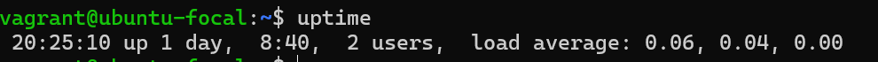

# Linux Commands Exercise

This document contains 10 Linux commands that were researched as part of the AltSchool cloud engineering exercise. Each command includes its description, usage example, and a screenshot.

---

## 1. `uptime`
**Description**: Displays how long the system has been running, along with load averages.

**Usage Example**:
uptime

**Screenshot**

## 2. df
**Description**: Gives free hard disk space on your system
**Usage Example**
df -h

**Screenshot**

## 3. free
**Description**: Shows memory usage.
**Usage Example**
free -m

**Screenshot**

## 4. top
**Description**:Real-time view of system process and resource usage
**Usage Example**
top

**Screenshoot**

## 5. wget
**Description**: Downloads files from the internet
**Usage Example**:
wget https://example.com/file.zip

**Screenshot**

##6. echo
**Description**: Prints text or variables to the terminal.
**Usage Example**
echo "Hello, World!"

**Screenshot**

##7. hostname
**Description**: Shows the system’s hostname.
**Usage Example**
hostname

**Screenshot**

##8. uname
**Description**:Shows system information.
**Usage Example**
uname -a  # Displays all system info
                           
**Screenshot**

##9.History
**Description**:Displays your command history 
**Usage Example**
history

**Screenshot**

##10.find
**Description**;Searches for files and directories.
**Usage Example**
find /home -name "file.txt"
**Screenshot**

